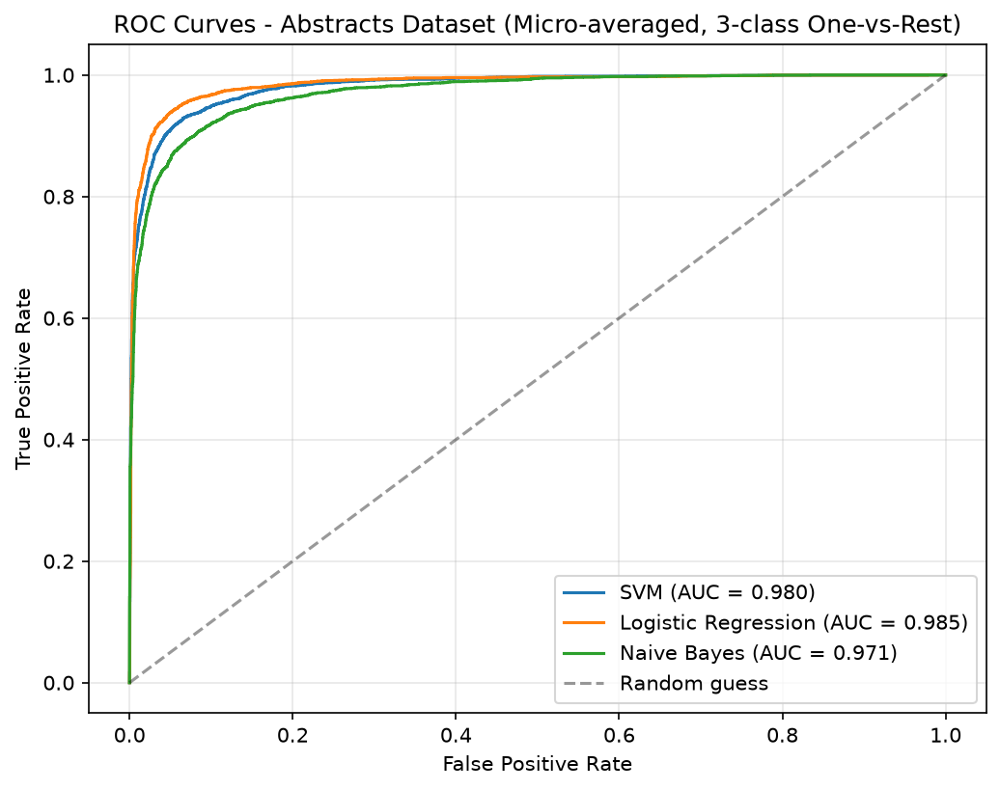
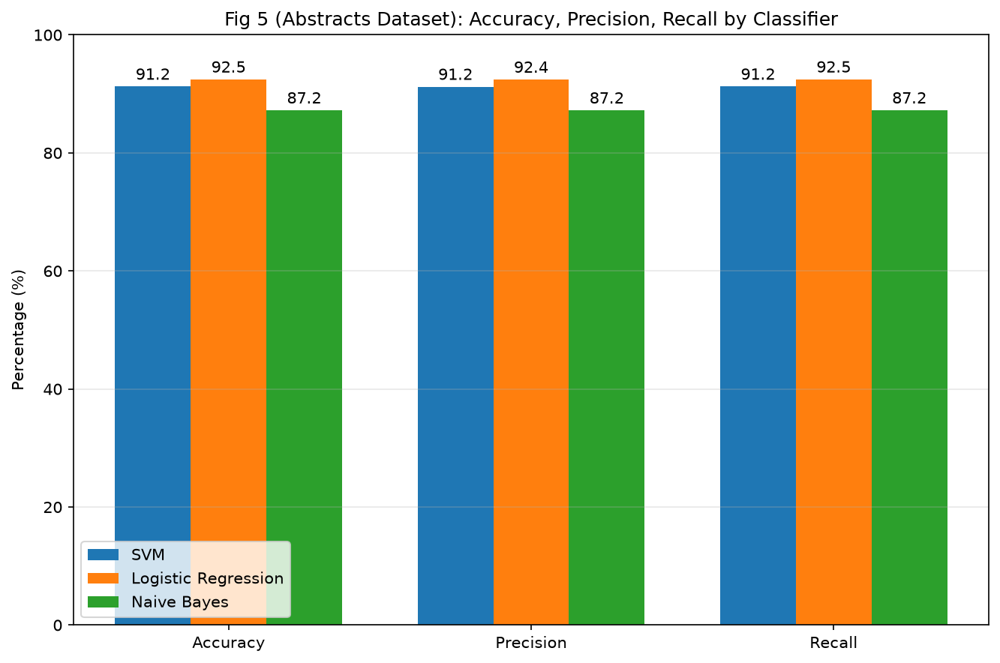

# SparkText Replication: Cancer Type Classification from PubMed Abstracts


A single-machine scikit-learn reproduction of the text-classification experiments in:

> Ye Z, Tafti AP, He KY, Wang K, He MM (2016). *SparkText: Biomedical Text Mining on Big Data Framework.* PLOS ONE 11(9): e0162721. https://doi.org/10.1371/journal.pone.0162721

The original work used Java and Apache Spark on a 20-node cluster. This project asks one question:

**How much of the paper's results survive when the same pipeline is rebuilt with scikit-learn on one laptop?**

**Short answer:** the main conclusions hold (SVM and Logistic Regression beat Naive Bayes; every model exceeds 87%), while the exact numbers, the SVM-vs-LR ordering, and the best regularizer differ.

## Contents

- [Key findings](#key-findings)
- [At a glance](#at-a-glance)
- [Dataset](#dataset)
- [Pipeline](#pipeline)
- [Quick start](#quick-start)
- [Project structure](#project-structure)
- [Results](#results)
- [Discussion](#discussion)
- [Scope and limitations](#scope-and-limitations)
- [Possible next steps](#possible-next-steps)
- [Reproducibility notes](#reproducibility-notes)
- [Troubleshooting](#troubleshooting)
- [Citation](#citation)
- [Credits](#credits)

## Key findings

1. **The headline result reproduces.** SVM (91.24%) and Logistic Regression (92.45%) clearly beat Naive Bayes (87.21%), matching the paper's qualitative ranking against Naive Bayes.
2. **The SVM/LR ordering flips.** The paper reports SVM ahead (94.63% vs. 92.19%). Here Logistic Regression is ahead of the default (L2) SVM by about 1.2 points.
3. **L1 regularization performs best here, not L2.** L1 lifts SVM to 93.07% and LR to 93.82%. Removing regularization hurts both.
4. **Runtime is not comparable.** The single-laptop run (0.92 min) beat the paper's 20-node cluster figure (3 min), but only because ~20k short documents are too small for distribution to pay off.

## At a glance

| Question | Answer |
|---|---|
| Task | Classify PubMed abstracts as **breast**, **lung**, or **prostate** cancer |
| Features | TF-IDF, unigrams + bigrams, 20,000 features |
| Models | Naive Bayes, linear SVM, Logistic Regression |
| Evaluation | 5-fold stratified cross-validation |
| Best accuracy (default L2) | **Logistic Regression, 92.45%** |
| Best accuracy (any setting) | **Logistic Regression with L1, 93.82%** |
| Main paper conclusion reproduced? | **Yes.** SVM and LR clearly beat Naive Bayes; all models exceed 87% |
| Where results differ | SVM vs. LR ordering; best regularizer (L1 here, L2 in the paper) |
| Full pipeline runtime | About 0.92 min on one laptop |

## Dataset

The 19,681 PubMed abstracts published by the paper's authors on Figshare (DOI `10.6084/m9.figshare.3796290`). Class counts match the paper's Table 2 exactly:

| Class | Abstracts | Share |
|---|---|---|
| Breast cancer | 6,137 | 31.2% |
| Lung cancer | 6,680 | 33.9% |
| Prostate cancer | 6,864 | 34.9% |
| **Total** | **19,681** | 100% |

The classes are roughly balanced, so plain accuracy is a reasonable headline metric.

The raw file is space-delimited with quoted text and Latin-1 encoding (not a standard CSV), so `load_data.py` uses a custom parser.

**Getting the data:** download the file from Figshare using the DOI above and place it in `data/raw/` before running the pipeline. The dataset is not redistributed in this repository.

## Pipeline

```
raw file ─▶ load_data ─▶ preprocess ─▶ TF-IDF ─▶ models ─▶ tables & figures
```

| Step | What happens |
|---|---|
| 1. Load and clean | Parse the raw file into a two-column table (`label`, `text`) |
| 2. Preprocess | Lowercase, strip punctuation and digits, remove stopwords, Porter stemming |
| 3. Features | TF-IDF with unigrams and bigrams (20,000 features, `min_df=2`) |
| 4. Models | Naive Bayes, linear SVM, Logistic Regression |
| 5. Evaluation | 5-fold stratified CV: accuracy / precision / recall, regularization sweep, ROC curves, runtime |

## Quick start

**Requirements:** Python 3.9+.

```bash
# optional: isolated environment
python -m venv .venv
source .venv/bin/activate        # Windows: .venv\Scripts\activate

pip install pandas scikit-learn numpy scipy matplotlib nltk

# one-time download of the stopword list used in preprocessing
python -c "import nltk; nltk.download('stopwords')"
```

Run the scripts **in this order** (each depends on the previous one's outputs):

```bash
python load_data.py          # parse raw file -> clean CSV
python preprocess.py         # clean + stem text
python feature_extraction.py # TF-IDF matrix
python train_models.py       # Table 3
python train_table4.py       # Table 4
python roc_curves.py         # Fig 4
python fig5_bar_chart.py     # Fig 5
python table5_runtime.py     # Table 5
```

Or run everything in one go (stops at the first failure):

```bash
python load_data.py && python preprocess.py && python feature_extraction.py \
  && python train_models.py && python train_table4.py && python roc_curves.py \
  && python fig5_bar_chart.py && python table5_runtime.py
```

Outputs are written to `data/processed/` and `results/`.

## Project structure

```
data/
  raw/                     Original dataset file from Figshare
  processed/               Cleaned data, TF-IDF matrix, labels
results/                   Output tables (CSV) and figures (PNG)

load_data.py               Parse raw file into a clean CSV
preprocess.py              Text cleaning and stemming
feature_extraction.py      TF-IDF (unigrams + bigrams)
train_models.py            Table 3: accuracy / precision / recall
train_table4.py            Table 4: L2 / L1 / no regularization
roc_curves.py              Fig 4: ROC curves
fig5_bar_chart.py          Fig 5: bar chart comparison
table5_runtime.py          Table 5: runtime measurement
inspect_raw.py             Helper used to inspect the raw file format
```

## Results

All numbers are from the **Abstracts** dataset with 5-fold stratified cross-validation.

### Accuracy, precision, recall (paper's Table 3)

| Classifier | Paper accuracy | This project | Precision | Recall | Δ vs. paper |
|---|---|---|---|---|---|
| SVM | 94.63% | 91.24% | 91.21% | 91.24% | −3.39 |
| Logistic Regression | 92.19% | 92.45% | 92.42% | 92.46% | +0.26 |
| Naive Bayes | 89.38% | 87.21% | 87.20% | 87.21% | −2.17 |

### Regularization (paper's Table 4, accuracy)

| Classifier | L2 (default) | L1 | None | Best |
|---|---|---|---|---|
| SVM | 91.24% | 93.07% | 91.14% | L1 (+1.83 over L2) |
| Logistic Regression | 92.45% | 93.82% | 90.39% | L1 (+1.37 over L2) |

### ROC curves (paper's Fig 4)

Micro-averaged one-vs-rest AUC:

| Classifier | AUC |
|---|---|
| Logistic Regression | 0.985 |
| SVM | 0.980 |
| Naive Bayes | 0.971 |



### Metrics by classifier (paper's Fig 5)



### Runtime (paper's Table 5)

| Tool | Time (minutes) |
|---|---|
| Weka Library (paper-reported) | 138 |
| TagHelper Tools (paper-reported) | 201 |
| SparkText on a 20-node cluster (paper-reported) | 3 |
| **This project**: Python / scikit-learn (measured on one laptop) | **0.92** |

> Runtime is not a like-for-like comparison. See the discussion below.

## Discussion

The main conclusions of the paper reproduce: SVM and Logistic Regression clearly outperform Naive Bayes, all models exceed 87% accuracy, and regularization affects results.

Some details differ, for reasons that are expected when swapping libraries and setups:

- **Different implementations.** The paper used Spark MLlib (SGD-based SVM and Logistic Regression). scikit-learn uses different optimizers, so exact numbers, and even the SVM vs. LR ordering, can shift by a few points.
- **Regularization ranking.** The paper found L2 best; here L1 performed best for both classifiers. L1 produces sparse weights, which may suit a 20,000-feature bigram space where many features are noise.
- **Feature cap.** TF-IDF was limited to 20,000 features for laptop-scale processing.
- **Citation headers not stripped.** Each abstract begins with journal/date/DOI metadata that was left in. This may act as a weak extra signal and could inflate scores slightly.
- **Runtime is not like-for-like.** At about 20,000 short documents, the overhead of a distributed cluster outweighs its benefits, so a single laptop finishes faster. Spark's advantage appears at much larger scale, which this project does not test. Weka and TagHelper times are quoted from the paper, not re-measured.

## Scope and limitations

- Only the **Abstracts** dataset was replicated. The paper's two full-text datasets were not run.
- Fig 4's ROC curve in the paper uses the Full-text Articles II dataset; here it is computed on Abstracts.
- Fig 5's Weka and TagHelper bars are not reproduced.
- The Big Data infrastructure claims (Spark, Hadoop, Cassandra) are not tested.
- The regularization comparison reports cross-validation scores for each setting directly, with no separate held-out test set. Differences of a point or so should be read as indicative, not definitive.
- Results are single runs; no confidence intervals or variance across seeds are reported.

## Possible next steps

- Strip the citation headers and re-run, to measure how much they help.
- Report per-class precision/recall and a confusion matrix to see which cancer types get confused.
- Report mean ± standard deviation across folds (and several seeds).
- Use nested cross-validation (or a held-out test set) for the regularization sweep.
- Replicate the two full-text datasets.
- Try the same models with Spark MLlib to separate library effects from scale effects.

## Reproducibility notes

- Use the same script order as in [Quick start](#quick-start); later scripts read files produced by earlier ones.
- Results depend on scikit-learn version and solver defaults. Record your versions with `pip freeze > requirements.txt` when you rerun.
- Cross-validation is stratified, so class proportions are preserved in every fold. Fix `random_state` in the scripts if you need identical folds across runs.
- Runtime in `table5_runtime.py` depends on your hardware; expect different numbers on different machines.

## Troubleshooting

| Problem | Likely cause / fix |
|---|---|
| `UnicodeDecodeError` when loading the data | The raw file is Latin-1, not UTF-8. Use `load_data.py` rather than `pd.read_csv` directly |
| `LookupError: Resource stopwords not found` | Run `nltk.download('stopwords')` |
| `FileNotFoundError` in a later script | An earlier step was skipped; rerun the scripts in order |
| Slow preprocessing | Porter stemming over ~20k abstracts is the bottleneck; run it once and reuse `data/processed/` |
| Missing figures in `results/` | Check that `roc_curves.py` and `fig5_bar_chart.py` finished without errors |

## Citation

If you use this replication, please cite the original paper:

```bibtex
@article{ye2016sparktext,
  title   = {SparkText: Biomedical Text Mining on Big Data Framework},
  author  = {Ye, Zhan and Tafti, Ahmad P. and He, Karen Y. and Wang, Kai and He, Max M.},
  journal = {PLOS ONE},
  volume  = {11},
  number  = {9},
  pages   = {e0162721},
  year    = {2016},
  doi     = {10.1371/journal.pone.0162721}
}
```

## Credits

Dataset and methodology by the authors of the SparkText paper. All code in this repository was written for this replication.
